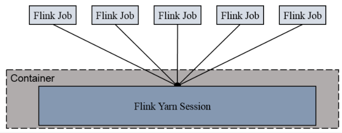
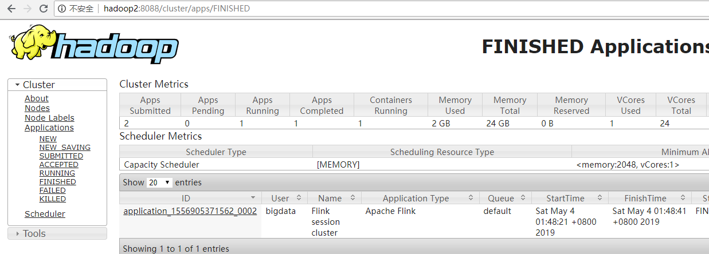

# Maven

## 1. 修改idea中maven工程默认的jdk版本

在pom.xml中加入如下配置：

```xml
<properties>
	<maven.compiler.source>1.8</maven.compiler.source>
	<maven.compiler.target>1.8</maven.compiler.target>
</properties>
```

# Netcat(nc)

## 1. windows平台用法

9999为自定义端口号

```shell
nc -L -p 9999
```

java代码读取端口数据

```java
public class TestMain {
    public static void main(String[] args) throws IOException {

        Socket socket = new Socket("localhost", 9999);
        BufferedReader br = new BufferedReader(new InputStreamReader(socket.getInputStream()));
        String line = br.readLine();

        while ((null != line) && !"exit".equals(line)) {
            System.out.println(line);

            line = br.readLine();
        }

        br.close();
        socket.close();
    }
}
```

## 2. linux平台用法

```shell
nc -lk 9999
```

# Redis

## 1. 启动redis-server

端口号默认**6379**

后台启动的话需要把myredis.conf文件中的daemonize no 改为yes

```shell
./redis-server ./myredis.conf
```

## 2. 查看redis进程

```shell
ps -ef | grep redis
```

## 3. 查看redis的版本

两种方式：

```shell
./redis-server --version
./redis-server -v
```

## 4. 设置redis后台启动

- 打开redis.conf

```shell
vim ./redis.conf
```

- 修改如下配置

```shell
daemonize yes
```

- 指定配置文件启动

```shell
./redis-server ./redis.conf
```

## 5. redis关于key的操作

### (1) 切换数据库

```shell
select 0
```

### (2) 查看当前库中所有的key

```shell
keys *
```

### (3) 判断key是否存在

```shell
exists key
```

### (4) 查看key数据类型

```shell
type key
```

### (5) 删除key

```shell
del key
```

### (6) 异步删除key

仅是将key从keyspace元数据中删除，真正的删除会在后续操作中

```she
unlink key
```

### (7) 设置key的过期时间

```she
expire key 10
```

### (8) 查看key的过期时间

-1表示永不过去，-2表示已经过期

```shell
ttl key
```

### (9) 查看当前数据库中key的数量

```shell
dbsize 
```

### (10) 清空当前数据库

```she
flushdb
```

### (11) 清空所有数据库

```shell
flushall
```

# Hadoop

## HDFS

### 1. 访问HDFS UI页面

3.x版本端口号是9870，老版本是50070

> http://hostname:9870/

# kafka

## 1. 启动kafka

启动kafka之前需要先启动zookeeper

```shell
bin/kafka-server-start.sh -daemon config/server.properties
```

## 2. 关闭kafka

```shell
bin/kafka-server-stop.sh stop
```

## 3. 查看kafka中的所有topic

--zookeeper linux01:2181的方式过期了

```shell
bin/kafka-topics.sh --bootstrap-server linux01:9092  --list
```

```shell
bin/kafka-topics.sh --zookeeper linux01:2181 --list
```

## 4. 创建topic

--zookeeper linux01:2181的方式过期了

```shell
bin/kafka-topics.sh --bootstrap-server linux01:9092 --create --replication-factor 1 --partitions 1 --topic test
```

```shell
bin/kafka-topics.sh --zookeeper linux01:2181 --create --replication-factor 1 --partitions 1 --topic test
```

选项说明：

--topic 定义 topic 名

--replication-factor 定义副本数

--partitions 定义分区数

## 5. 删除topic

--zookeeper linux01:2181的方式过期了

注意：需要 server.properties 中设置 delete.topic.enable=true ，否则只是标记删除

```shell
bin/kafka-topics.sh --bootstrap-server linux01:9092 --delete --topic second
```

```shell
bin/kafka-topics.sh --zookeeper linux01:2181 --delete --topic second
```

## 6. 控制台生产消息

```shell
bin/kafka-console-producer.sh --bootstrap-server linux01:9092 --topic test
```

```shell
bin/kafka-console-producer.sh --broker-list linux01:9092 --topic test
```

## 7. 控制台消费消息

--zookeeper linux01:2181的方式过期了

--from-beginning 配置从开始位置开始消费

```shell
bin/kafka-console-consumer.sh --bootstrap-server linux01:9092 --topic test --from-beginning
```

```shell
bin/kafka-console-consumer.sh --zookeeper linux01:2181 --topic test --from-beginning
```

## 8. 查看某个topic详情

```shell
bin/kafka-topics.sh --bootstrap-server linux01:9092 --describe --topic test
```

```shell
bin/kafka-topics.sh --zookeeper linux01:2181 --describe --topic test
```

## 9. 修改topic的分区数

```shell
bin/kafka-topics.sh --bootstrap-server linux01:9092 --alter --topic test --partitions 2
```

# Zookeeper

## 1. 启动zookeeper服务端

```shell
bin/zkServer.sh start
```

## 2. 停止zookeeper服务端

```shell
bin/zkServer.sh stop
```

## 3. 查看zookeeper服务端状态

```shell
bin/zkServer.sh status
```

# Scala

## 1. Scala中的json序列化和反序列化

### 1.1 引入依赖

```xml
<dependency>
    <groupId>org.json4s</groupId>
    <artifactId>json4s-native_2.12</artifactId>
    <version>3.6.6</version>
</dependency>
```

### 1.2 序列化

```scala
// scala样例类进行json序列化和反序列化需要先引入隐式转换
implicit val formats: DefaultFormats.type = org.json4s.DefaultFormats
val json:String = Serialization.write(cityInfo)
```

### 1.3 反序列化

```scala
// scala样例类进行json序列化和反序列化需要先引入隐式转换
implicit val formats: DefaultFormats.type = org.json4s.DefaultFormats
val info: CityInfo = Serialization.read[CityInfo](json)
```

# Spark

## 1. Structured Streaming（Spark V3.0.0）在windows平台idea中报出Error writing stream metadata StreamMetadata

> 1. 安装vc_redist_x64.exe（2010版本）；
>
> 2. 代码中第一行加上代码System.setProperty("hadoop.home.dir", "D:\\software\\devsoft\\hadoopBin")，
>
>    其中该目录下需要有hadoop的winutils.exe文件。

# flink

## 1. 启动集群

```shell
bin/start-cluster.sh
```

去web UI控制台查看http://hostname:8081/

## 2. 关闭集群

```shell
bin/stop-cluster.sh		
```

## 3. 运行官方wordCount案例

```shell
./bin/flink run ./examples/batch/WordCount.jar --input /opt/software/test/data/word.txt --output /opt/software/test/output/wordcount
```

## 4. 命令行方式提交任务

```shell
bin/flink run -c cn.jly.bigdata.flink.datastream.c01_quickstart.D02_StreamWordCount -p 2 ./module10-flink-java-1.0.0.jar --host linux01 --port 9999
```

-c：指定main class

-p: 指定并行度

提交之后到http://hostname:8081查看任务的执行情况

## 5. yarn模式提交任务

以 Yarn 模式部署 Flink 任务时，要求 Flink 是有 Hadoop 支持的版本，Hadoop环境需要保证版本在 2.2 以上，并且集群中安装有 HDFS 服务。Flink 提供了两种在 yarn 上运行的模式，分别为 Session-Cluster 和 Per-Job-Cluster模式。

### (1) Session-Cluster模式



Session-Cluster 模式需要先启动集群，然后再提交作业，接着会向 yarn 申请一块空间后，资源永远保持不变。如果资源满了，下一个作业就无法提交，只能等到yarn 中的其中一个作 业执行完成后，释放了资源，下个作业才会正常提交。所有作业共享 Dispatcher 和 ResourceManager ；共享资源；适合规模小执行时间短的作业。

**在yarn 中初始化一个 flink 集群，开辟指定的资源，以后提交任务都向这里提交。这个 flink 集群会常驻在 yarn 集群中，除非手工停止。**

① 启动hadoop集群

② 启动yarn-session 

```shell
bin/yarn-session.sh -n 2 -s 2 -jm 1024 -tm 1024 -nm test -d
```

其中：
-n( container) ，TaskManager 的数量。
-s( slots) ，每个 TaskManager 的 slot 数量，默认一个 slot 一个 core ，默认每个taskmanager 的 slot 的个数为 1 ，有时可以多一taskmanager ，做冗余。
-jm，JobManager 的内存（单位 MB) 。
-tm，每个 taskmanager 的内存（单位 MB) 。
-nm，yarn 的 appName( 现在 yarn 的 ui 上的名字 。
-d，后台执行。

③ 执行任务

```shell
bin/flink run -c cn.jly.bigdata.flink.datastream.c01_quickstart.D02_StreamWordCount -p 2 ./module10-flink-java-1.0.0.jar --host linux01 --port 9999
```

④ 去yarn控制台查看执行情况 http://hostname:8088



⑤ 取消yarn-session

```shell
yarn application --kill application_id
```

### (2) Per-Job-Cluster模式


一个Job 会对应一个集群，每提交一个作业会根据自身的情况，都会单独向 yarn申请资源，直到作业执行完成，一个作业的失败与否并不会影响下一个作业的正常提交和运行。独享 Dispatcher 和 ResourceManager ，按需接受资源申请；适合规模大长时间运行的作业。

**每次提交都会创建一个新的flink 集群，任务之间互相独立，互不影响，方便管理。任务执行完成之后创建的集群也会消失。**

① 启动hadoop集群

② 不启动 yarn-session ，直接执行 job

```shell
bin/flink run -Dexecution.runtime-mode=AUTOMATIC -m yarn-cluster -yjm 1024 -ytm 1024 -c cn.jly.bigdata.flink.datastream.c01_quickstart.D05_DataStreamApi_lambda_yarn -p 2 ./original-module10-flink-java-1.0.0.jar --host linux01 --port 9999
```

```shell
bin/flink run -Dexecution.runtime-mode=BATCH -m yarn-cluster -yjm 1024 -ytm 1024 -c cn.jly.bigdata.flink.datastream.c01_quickstart.D05_DataStreamApi_lambda_yarn -p 2 ./original-module10-flink-java-1.0.0.jar --inputPath hdfs://linux01:8020/input/
```

-Dexecution.runtime-mode=AUTOMATIC 指定运行模式，这边是根据数据源自动推断（代码中也可以指定）

-m 指定jobManager的地址

-yjm 指定jobManager的内存大小

-ytm 指定taskManager的内存大小

## 6. 查看flink有命令行参数

```shell
./bin/flink --help
```

# Mysql

## 1. 查看表的创建信息

```mysql
show create table tbl_user;
```

# Idea

## 1. 查看类的继承关系

```shell
F4
```

## 2. 快速定位到错误位置

```shell
shift + F1
```

## 3. 查看变量或者方法的所有调用位置

```shell
ctrl + g
```

## 南京IT企业
> https://www.zhihu.com/question/27273005