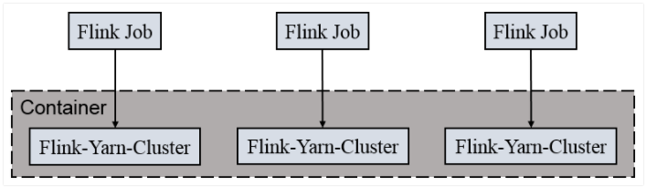

# Java获取类所在包及其子包中的所有子类

## 1. Reflections工具类方式

先引入依赖

```xml
<dependency>
      <groupId>org.reflections</groupId>
      <artifactId>reflections</artifactId>
      <version>0.9.12</version>
</dependency>
```

代码实现：

```java
Reflections reflections = new Reflections(HLAobjectRoot.class.getPackage().getName());
Set<Class<? extends HLAobjectRoot>> subTypesOf = reflections.getSubTypesOf(HLAobjectRoot.class);
for (Class<? extends HLAobjectRoot> subClazz : subTypesOf) {
    System.out.println(subClazz);
}
```


# Maven

## 1. 修改idea中maven工程默认的jdk版本

在pom.xml中加入如下配置：

```xml
<properties>
	<maven.compiler.source>1.8</maven.compiler.source>
	<maven.compiler.target>1.8</maven.compiler.target>
</properties>
```


# Netcat(nc)

## 1. windows平台用法

9999为自定义端口号

```shell
nc -L -p 9999
```

java代码读取端口数据

```java
public class TestMain {
    public static void main(String[] args) throws IOException {

        Socket socket = new Socket("localhost", 9999);
        BufferedReader br = new BufferedReader(new InputStreamReader(socket.getInputStream()));
        String line = br.readLine();

        while ((null != line) && !"exit".equals(line)) {
            System.out.println(line);

            line = br.readLine();
        }

        br.close();
        socket.close();
    }
}
```

## 2. linux平台用法

```shell
nc -lk 9999
```


# Redis

## 1. 启动redis-server

端口号默认**6379**

后台启动的话需要把myredis.conf文件中的daemonize no 改为yes

```shell
./redis-server ./myredis.conf
```

## 2. 查看redis进程

```shell
ps -ef | grep redis
```

## 3. 查看redis的版本

两种方式：

```shell
./redis-server --version
./redis-server -v
```

## 4. 设置redis后台启动

- 打开redis.conf

```shell
vim ./redis.conf
```

- 修改如下配置

```shell
daemonize yes
```

- 指定配置文件启动

```shell
./redis-server ./redis.conf
```

## 5. redis关于key的操作

### (1) 切换数据库

```shell
select 0
```

### (2) 查看当前库中所有的key

```shell
keys *
```

### (3) 判断key是否存在

```shell
exists key
```

### (4) 查看key对应的值的数据类型

```shell
type key
```

### (5) 删除key

```shell
del key
```

### (6) 异步删除key

仅是将key从keyspace元数据中删除，真正的删除会在后续异步操作中

```she
unlink key
```

### (7) 设置key的过期时间

时间以秒为单位

```she
expire key 10
```

### (8) 查看key的过期时间

-1表示永不过去，-2表示已经过期

```shell
ttl key
```

### (9) 查看当前数据库中key的数量

```shell
dbsize 
```

### (10) 清空当前数据库

```she
flushdb
```

### (11) 清空所有数据库

```shell
flushall
```

## 6. Redis五大类型之String

String是Redis最基本的类型，你可以理解成与Memcached一模一样的类型，一个key对应一个value；

String类型是二进制安全的。意味着Redis的string可以包含任何数据。比如jpg图片或者序列化的对象；

String类型是Redis最基本的数据类型，一个Redis中字符串value最多可以是512M。

### (1) 添加键值对/修改指定key的值

```shell
set k1 v1
```

### (2) 查询指定key的值

```shell
get k1
```

### (3) 将给定的value添加到指定key的末尾

```shell
append k1 v2
```

### (4) 获取指定key的值的长度

```shell
strlen k1
```

### (5) 只有在 key 不存在时 ，设置 key 的值

```shell
setnx k1 v2
```

### (6) 将 key 中储存的数字值增1

只能对数字值操作，如果为空，新增值为1；如果对应value不是数字类型，会报错

```shell
incr k2
```

### (7) 将 key 中储存的数字值减1

只能对数字值操作，如果为空，新增值为-1

```shell
decr k3
```

### (8) 将 key 中储存的数字值增减，且通过自定义步长

```she
incrby k1 2
decrby k1 2
```

### (9) 同时设置一个或者多个kv对

```shell
mset k1 v1 k2 v2 k3 v3
```

### (10) 同时查询多个key的值

```shell
mget k1 s1
```

### (11) 同时设置一个或多个 key-value 对

当且仅当所有给定 key 都不存在，**原子性，有一个失败则都失败**

```shell
msetnx k1 v1 k2 v2 k3 v3
```

### (12) 获取范围的值（字串）

类似与Java中的subString，但是这里是前后都包括

```shell
getrange k1 1 2
```

### (13) 设置范围的值（字串）

从指定索引位置，覆盖给定value的值进入原value。比如k1="abcdefg0"，指定setrange k1 1 value，则k1变为"avalueg0"

```shell
setrange k1 3 value
```

### (14) 设置键值的同时，设置过期时间，单位秒

```shell
setnx k1 10 value
```

### (15) 以新换旧，设置了新值同时获得旧值

```she
getset k1 v1
```

## 10. 常见错误及解决办法

### (1) 强制关闭Redis快照导致不能持久化 

**现象**：MISCONF Redis is configured to save RDB snapshots, but it is currently not able to persist on disk. Commands that may modify the data set are disabled, because this instance is configured to report errors during writes if RDB snapshotting fails (stop-writes-on-bgsave-error option). Please check the Redis logs for details about the RDB error. 即Redis被配置为保存数据库快照，但它目前不能持久化到硬盘。用来修改集合数据的命令不能用。请查看Redis日志的详细错误信息。

**原因**：强制关闭Redis快照导致不能持久化

**解决办法**：将stop-writes-on-bgsave-error设置为no

```shell
127.0.0.1:6379> config set stop-writes-on-bgsave-error no
```

# Hadoop

## HDFS

### 1. 访问HDFS UI页面

3.x版本端口号是9870，老版本是50070

> http://hostname:9870/


# Hive

## 1. 启动hive metastore服务

```shell
nohup hive --service metastore > /home/lanyangji/hive-metastore.log 2>&1 &
```


# kafka

## 1. 启动kafka

启动kafka之前需要先启动zookeeper

```shell
bin/kafka-server-start.sh -daemon config/server.properties
```

## 2. 关闭kafka

```shell
bin/kafka-server-stop.sh stop
```

## 3. 查看kafka中的所有topic

--zookeeper linux01:2181的方式过期了

```shell
bin/kafka-topics.sh --bootstrap-server linux01:9092  --list
```

```shell
bin/kafka-topics.sh --zookeeper linux01:2181 --list
```

## 4. 创建topic

--zookeeper linux01:2181的方式过期了

```shell
bin/kafka-topics.sh --bootstrap-server linux01:9092 --create --replication-factor 1 --partitions 1 --topic test
```

```shell
bin/kafka-topics.sh --zookeeper linux01:2181 --create --replication-factor 1 --partitions 1 --topic test
```

选项说明：

--topic 定义 topic 名

--replication-factor 定义副本数

--partitions 定义分区数

## 5. 删除topic

--zookeeper linux01:2181的方式过期了

注意：需要 server.properties 中设置 delete.topic.enable=true ，否则只是标记删除

```shell
bin/kafka-topics.sh --bootstrap-server linux01:9092 --delete --topic second
```

```shell
bin/kafka-topics.sh --zookeeper linux01:2181 --delete --topic second
```

## 6. 控制台生产消息

```shell
bin/kafka-console-producer.sh --bootstrap-server linux01:9092 --topic test
```

```shell
bin/kafka-console-producer.sh --broker-list linux01:9092 --topic test
```

## 7. 控制台消费消息

--zookeeper linux01:2181的方式过期了

--from-beginning 配置从开始位置开始消费

```shell
bin/kafka-console-consumer.sh --bootstrap-server linux01:9092 --topic test --from-beginning
```

```shell
bin/kafka-console-consumer.sh --zookeeper linux01:2181 --topic test --from-beginning
```

## 8. 查看某个topic详情

```shell
bin/kafka-topics.sh --bootstrap-server linux01:9092 --describe --topic test
```

```shell
bin/kafka-topics.sh --zookeeper linux01:2181 --describe --topic test
```

## 9. 修改topic的分区数

```shell
bin/kafka-topics.sh --bootstrap-server linux01:9092 --alter --topic test --partitions 2
```


# Zookeeper

## 1. 启动zookeeper服务端

```shell
bin/zkServer.sh start
```

## 2. 停止zookeeper服务端

```shell
bin/zkServer.sh stop
```

## 3. 查看zookeeper服务端状态

```shell
bin/zkServer.sh status
```


# Scala

## 1. Scala中的json序列化和反序列化

### 1.1 引入依赖

```xml
<dependency>
    <groupId>org.json4s</groupId>
    <artifactId>json4s-native_2.12</artifactId>
    <version>3.6.6</version>
</dependency>
```

### 1.2 序列化

```scala
// scala样例类进行json序列化和反序列化需要先引入隐式转换
implicit val formats: DefaultFormats.type = org.json4s.DefaultFormats
val json:String = Serialization.write(cityInfo)
```

### 1.3 反序列化

```scala
// scala样例类进行json序列化和反序列化需要先引入隐式转换
implicit val formats: DefaultFormats.type = org.json4s.DefaultFormats
val info: CityInfo = Serialization.read[CityInfo](json)
```


# Spark

## 1. 本地模式 

### (1) 启动local环境

```shell
./bin/spark-shell			
```

启动成功之后，可以访问Spark的WebUI，地址为：http://linux01:4040

### (2) 退出本地模式

使用ctrl + c或者输入scala指令：

```shell
:quit
```

### (3) 本地模式提交引用

```shell
./bin/spark-submit --class cn.spark_advanced.core.c01_quickstart.D01_WorldCount --master local[*] /opt/software/test/app.jar /opt/software/test/input/word.txt
```

① --class 表示要执行程序的主类，此处可以更换为咱们自己写的应用程序

② --master local[*] 部署模式，默认为本地模式，数字表示分配的虚拟 CPU 核数量; *号表示使用所在机器所有的CPU核心

③ /opt/software/test/app.jar 运行的应用类所在的 jar 包，实际使用时，可以设定为咱们自己打的 jar 包

④ /opt/software/test/input/word.txt 表示程序的入口参数，本例中是表示数据输入路径

## 2. Standalone独立模式

### (1) Standalone独立模式默认的WebUI访问地址

http://linux01:8080

### (2) 独立模式下提交应用

```shel
./bin/spark-submit --class cn.spark_advanced.core.c01_quickstart.D01_WorldCount --master spark://linux01:7077 /opt/software/test/app.jar /opt/software/test/input/word.txt
```

① --class 表示要执行程序的主类，此处可以更换为咱们自己写的应用程序

② --master spark://linux01:7077 独立部署模式，连接到 Spark 集群；其中7077是Spark独立模式Master通信端口

③ /opt/software/test/app.jar 运行的应用类所在的 jar 包，实际使用时，可以设定为咱们自己打的 jar 包

④ /opt/software/test/input/word.txt 表示程序的入口参数，本例中是表示数据输入路径

## 3. YARN模式

### (1) 启动Hadoop的Yarn和Hdfs服务

### (2) 提交应用

```shell
./bin/spark-submit --class cn.spark_advanced.core.c01_quickstart.D01_WorldCount --master yarn --deploy-mode cluster/client hdfs:///apps/wordcount.jar hdfs:///input/word.txt 
```

### (3) 在yarn上查看任务执行情况（需要提前配置历史服务器）

http://linux01:8088，点击history

## 4. 常用提交参数说明

| 参数                     | 解释                                                         | 可选值示例                                 |
| ------------------------ | ------------------------------------------------------------ | ------------------------------------------ |
| --class                  | Spark中包含主函数的类                                        |                                            |
| --master                 | Spark程序运行的模式（环境）                                  | 模式：local[*]，spark://linux01:7077，Yarn |
| --deploy-mode            | YARN集群模式下指定cluster或者client模式，区别在于driver所处的位置，前者driver在集群中，后者driver在本地 | cluster，client                            |
| --executor-memory 1G     | 指定每个可用的executor的内存为1G                             | 符合集群内存配置即可，具体情况具体分析     |
| --total-executor-cores 2 | 指定所有executor使用的cpu核数                                | 符合集群内存配置即可，具体情况具体分析     |
| --executor-cores         | 指定分配给每个executor的cpu核数                              | 符合集群内存配置即可，具体情况具体分析     |
| appliacation-jar         | 打包好的应用 jar，包含依赖。这个 URL 在集群中全局可见。 比 如 hdfs:// 共享存储系统，如果是file:// path，那么所有的节点的path 都包含同样的 jar | 符合集群内存配置即可，具体情况具体分析     |
| application-arguments    | 传给 main()方法的参数                                        | 符合集群内存配置即可，具体情况具体分析     |

## 5. 常用端口号

① Spark 查看当前 Spark-shell 运行任务情况端口号：4040（计算）

② Spark Master 内部通信服务端口号：7077

③ Standalone 模式下，Spark Master Web 端口号：8080（资源）

④ Spark 历史服务器端口号：18080

⑤ Hadoop YARN 任务运行情况查看端口号：8088

## 6. 部署模式对比

| 模式       | Spark安装机器数 | 需要启动的进程   | 所属者 | 应用场景 |
| ---------- | --------------- | ---------------- | ------ | -------- |
| local      | 1               | 无               | Spark  | 测试     |
| Standalone | N               | Master 和 Worker | Spark  | 单独部署 |
| Yarn       | 1               | Yarn和Hdfs       | Hadoop | 混合部署 |


## 10. 常见问题及解决方案

###  (1) Structured Streaming（Spark V3.0.0）在windows平台idea中报出Error writing stream metadata StreamMetadata

> 1. 安装vc_redist_x64.exe（2010版本）；
>
> 2. 代码中第一行加上代码System.setProperty("hadoop.home.dir", "D:\\software\\devsoft\\hadoopBin")，
>
>    其中该目录下需要有hadoop的winutils.exe文件。


# flink

## 1. 启动集群

```shell
bin/start-cluster.sh
```

去web UI控制台查看http://hostname:8081/

## 2. 关闭集群

```shell
bin/stop-cluster.sh		
```

## 3. 运行官方wordCount案例

```shell
./bin/flink run ./examples/batch/WordCount.jar --input /opt/software/test/data/word.txt --output /opt/software/test/output/wordcount
```

## 4. 命令行方式提交任务

```shell
bin/flink run -c cn.jly.bigdata.flink.datastream.c01_quickstart.D02_StreamWordCount -p 2 ./module10-flink-java-1.0.0.jar --host linux01 --port 9999
```

-c：指定main class

-p: 指定并行度

提交之后到http://hostname:8081查看任务的执行情况

## 5. yarn模式提交任务

以 Yarn 模式部署 Flink 任务时，要求 Flink 是有 Hadoop 支持的版本，Hadoop环境需要保证版本在 2.2 以上，并且集群中安装有 HDFS 服务。Flink 提供了两种在 yarn 上运行的模式，分别为 Session-Cluster 和 Per-Job-Cluster模式。

### (1) Session-Cluster模式


Session-Cluster 模式需要先启动集群，然后再提交作业，接着会向 yarn 申请一块空间后，资源永远保持不变。如果资源满了，下一个作业就无法提交，只能等到yarn 中的其中一个作 业执行完成后，释放了资源，下个作业才会正常提交。所有作业共享 Dispatcher 和 ResourceManager ；共享资源；适合规模小执行时间短的作业。

**在yarn 中初始化一个 flink 集群，开辟指定的资源，以后提交任务都向这里提交。这个 flink 集群会常驻在 yarn 集群中，除非手工停止。**

① 启动hadoop集群

② 启动yarn-session 

```shell
bin/yarn-session.sh -n 2 -s 2 -jm 1024 -tm 1024 -nm test -d
```

其中：
-n( container) ，TaskManager 的数量。
-s( slots) ，每个 TaskManager 的 slot 数量，默认一个 slot 一个 core ，默认每个taskmanager 的 slot 的个数为 1 ，有时可以多一taskmanager ，做冗余。
-jm，JobManager 的内存（单位 MB) 。
-tm，每个 taskmanager 的内存（单位 MB) 。
-nm，yarn 的 appName( 现在 yarn 的 ui 上的名字 。
-d，后台执行。

③ 执行任务

```shell
bin/flink run -c cn.jly.bigdata.flink.datastream.c01_quickstart.D02_StreamWordCount -p 2 ./module10-flink-java-1.0.0.jar --host linux01 --port 9999
```

④ 去yarn控制台查看执行情况 http://hostname:8088


⑤ 取消yarn-session

```shell
yarn application --kill application_id
```

### (2) Per-Job-Cluster模式



一个Job 会对应一个集群，每提交一个作业会根据自身的情况，都会单独向 yarn申请资源，直到作业执行完成，一个作业的失败与否并不会影响下一个作业的正常提交和运行。独享 Dispatcher 和 ResourceManager ，按需接受资源申请；适合规模大长时间运行的作业。

**每次提交都会创建一个新的flink 集群，任务之间互相独立，互不影响，方便管理。任务执行完成之后创建的集群也会消失。**

① 启动hadoop集群

② 不启动 yarn-session ，直接执行 job

```shell
bin/flink run -Dexecution.runtime-mode=AUTOMATIC -m yarn-cluster -yjm 1024 -ytm 1024 -c cn.jly.bigdata.flink.datastream.c01_quickstart.D05_DataStreamApi_lambda_yarn -p 2 ./original-module10-flink-java-1.0.0.jar --host linux01 --port 9999
```

```shell
bin/flink run -Dexecution.runtime-mode=BATCH -m yarn-cluster -yjm 1024 -ytm 1024 -c cn.jly.bigdata.flink.datastream.c01_quickstart.D05_DataStreamApi_lambda_yarn -p 2 ./original-module10-flink-java-1.0.0.jar --inputPath hdfs://linux01:8020/input/
```

-Dexecution.runtime-mode=AUTOMATIC 指定运行模式，这边是根据数据源自动推断（代码中也可以指定）

-m 指定jobManager的地址

-yjm 指定jobManager的内存大小

-ytm 指定taskManager的内存大小

## 6. 查看flink有命令行参数

```shell
./bin/flink --help
```

# Mysql

## 1. 查看表的创建信息

```mysql
show create table tbl_user;
```

# Idea

## 1. 查看类的继承关系

```shell
F4
```

## 2. 快速定位到错误位置

```shell
shift + F1
```

## 3. 查看变量或者方法的所有调用位置

```shell
ctrl + g
```

# 南京IT企业
> https://www.zhihu.com/question/27273005

# 需求：

- **订单自动好评 - flink定时器**

  一般订单完成之后，如果用户在一定时间没有评价，系统自动给予五星好评

- **模拟双十一实时大屏统计 - flink窗口、触发器等**

  在大数据的实时处理中，实时的大屏展示已经成了一个很重要的展示项，比如最有名的双十一大屏实时销售总价展示。除了这个，还有一些其他场景的应用，比如我们在我们的后台系统实时的展示我们网站当前的pv、uv等等今天我们就做一个最简单的模拟电商统计大屏的小例子。需求如下：

   * 1.实时计算出当天零点截止到当前时间的销售总额 11月11日 00:00:00 ~ 23:59:59
   * 2.计算出各个分类的销售top3
   * 3.每秒钟更新一次统计结果

- **实时过滤出配置中的用户，并在事件流中补全这批用户的基础信息 - flink广播状态**

  在开发过程中，如果遇到需要下发/广播配置、规则等低吞吐事件流到下游所有 task 时，就可以使用 Broadcast State。

  Broadcast State 是 Flink 1.5 引入的新特性。

  下游的 task 接收这些配置、规则并保存为 BroadcastState, 将这些配置应用到另一个数据流的计算中 。

  场景举例

  ​	1. 动态更新计算规则: 如事件流需要根据最新的规则进行计算，则可将规则作为广播状态广播到下游Task中。

  ​	2. 实时增加额外字段: 如事件流需要实时增加用户的基础信息，则可将用户的基础信息作为广播状态广播到下游Task中。<p>

  需求：

  ​	实时过滤出配置中的用户，并在事件流中补全这批用户的基础信息。

  ​	事件流：表示用户在某个时刻浏览或点击了某个商品，格式如下。

  ​		{"userID": "user_3", "eventTime": "2019-08-17 12:19:47", "eventType": "browse", "productID": 1}

  ​		{"userID": "user_2", "eventTime": "2019-08-17 12:19:48", "eventType": "click", "productID": 1}

  mysql中存储的用户信息，成为配置流、规则流或者用户信息流：

  ​		<id, name, age>

  要求输出：

  ​		<userId, productId, eventTime, eventType, name, age>

- **双流join**
